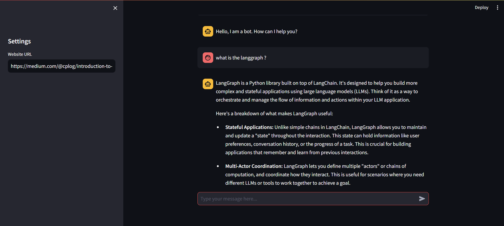

# 🤖 WebChat – Chat with Any Website!

**WebChat** is a Streamlit-powered conversational chatbot that allows users to interact with the content of any website using natural language. By combining the power of LangChain, Google's Gemini model, and ChromaDB, this app retrieves, embeds, and queries website content to provide accurate, context-aware responses.

---

## 🚀 Features

- 🔗 Load and parse any public webpage.
- 🧠 Automatically chunk content for efficient retrieval.
- 📚 Store and search content using Chroma vector database.
- 🧵 Maintain conversation history for context-aware chats.
- 🤖 Powered by Google Gemini for smart, insightful answers.
- 🧩 Built with LangChain’s Retrieval-Augmented Generation (RAG) pipeline.

---

## 🛠️ Tech Stack

- [Streamlit](https://streamlit.io/) – for the web UI.
- [LangChain](https://www.langchain.com/) – for managing chains and memory.
- [Google Generative AI (Gemini)](https://ai.google.dev/) – LLM and embeddings.
- [ChromaDB](https://www.trychroma.com/) – persistent vector store.
- [BeautifulSoup4](https://www.crummy.com/software/BeautifulSoup/) – for web scraping.
- [dotenv](https://pypi.org/project/python-dotenv/) – to manage API keys securely.

---

## 📦 Installation

Make sure you have Python 3.8+ installed.

```bash
git clone https://github.com/yourusername/webchat.git
cd webchat
pip install -r requirements.txt
```

## 🔐 Environment Variables

Create a .env file in the project root with your API key:
```bash
GOOGLE_API_KEY=your_google_gemini_api_key_here
```

Make sure to replace `your_google_gemini_api_key_here` with your actual API key.

## 💬 Usage
Run the app:

```bash
streamlit run app.py
```
1- Enter a website URL in the sidebar.

2- Wait a few seconds while the site content is processed.

3- Start chatting with the content in the input box!

## 🧪 Example Use Cases
1- Summarize a blog post.

2- Ask questions about product pages.

3- Extract insights from documentation or news sites.

4- Convert website content into Q&A-style learning.

## 📸 Screenshot
Here’s a preview of the app in action:




## 🤔 Limitations
- Only works with public webpages (not behind login/auth).

- May struggle with very large or JavaScript-heavy pages.

- Currently no multi-page crawling.

## 🧠 How It Works
1- WebBaseLoader loads the raw text content from the website.

2- TextSplitter chunks it into smaller documents.

3- Chroma stores the documents as vector embeddings.

4- GoogleGenerativeAIEmbeddings converts text into vector embeddings.

5- RAG Chain is constructed using:

- A Retriever to fetch relevant chunks

- A Conversational LLM to answer contextually

6- Streamlit Chat UI manages interactions and conversation memory.

## Author

Created by [Adnane Markue](https://github.com/Adnane-markue)
